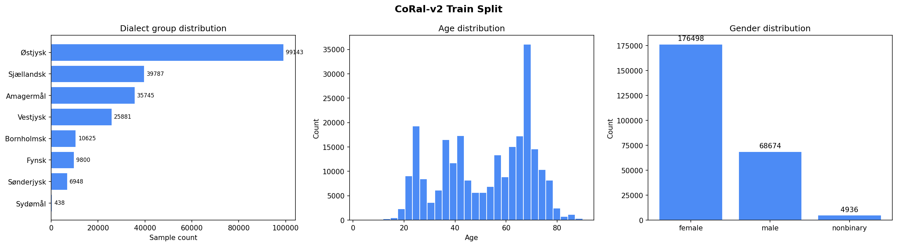
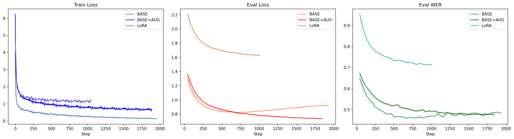
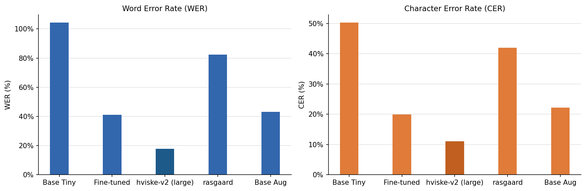

# Whisper Danish Fine-tuning

Fine-tuning OpenAI Whisper-tiny on Danish speech, with evaluation scripts and a FastAPI inference API.

## Setup

The model was trained on Python 3.10 and a CUDA-capable GPU (tested with CUDA 11.7).

```bash
# Create and activate a pyenv virtualenv
pyenv install 3.10.14
pyenv virtualenv 3.10.14 whisper-danish
pyenv activate whisper-danish

# Install dependencies
pip install -r requirements.txt --extra-index-url https://download.pytorch.org/whl/cu117
```

## Usage

**Train**
```bash
CUDA_VISIBLE_DEVICES=1,2 torchrun --nproc_per_node=2 train_whisper.py --config configs/whisper-tiny.yml
```

**Evaluate**
```bash
python evaluate_model.py
```

**Get metrics**
```bash
python get_metrics.py
```

## Dataset

The model was trained on [CoRal-v2](https://huggingface.co/datasets/CoRal-project/coral-v2) (`read_aloud` split) — a large Danish speech corpus with ~250k training samples and ~9k test samples. Speakers span a wide range of ages and represent most Danish dialect groups, making the dataset a strong proxy for real-world spoken Danish.



## Training

Three variants of `openai/whisper-tiny` (~40M parameters) were fine-tuned for up to 50k steps (~12 epochs) on 2× TITAN X GPUs, using batch size 64 and learning rate 5e-5 with warmup and decay:

- **BASE** — encoder frozen, decoder fully fine-tuned
- **BASE+AUG** — same as BASE with speed/duration perturbation and noise injection to reduce overfitting
- **LoRA** — low-rank adapter applied to a subset of decoder layers

The LoRA model underperformed and was stopped early — LoRA is ill-suited to smaller Whisper variants where constrained parameter updates degrade performance. The BASE model converges fastest but overfits slightly after the first third of training; the best checkpoint by validation WER was kept. BASE+AUG successfully reduces overfitting at the cost of slower convergence.



## Evaluation

Models were evaluated on the CoRal-v2 test split using WER and CER, and benchmarked against the untuned `whisper-tiny` baseline, `rasgaard/whisper-tiny.da` (the only other publicly available fine-tuned tiny model), and `hviske-v2` (the Danish SOTA, based on `whisper-large` at 1.55B parameters).

The fine-tuned model scores **~41% WER / ~20% CER**, beating both the baseline (~104% WER) and the rasgaard model (~83% WER), while expectedly trailing the much larger hviske-v2 (~19% WER).



## API

The fine-tuned model is served via a FastAPI inference server.

Start it with:

```bash
cd whisper-api
docker compose up --build
```

The interactive API docs are then available at [http://localhost:8000/docs](http://localhost:8000/docs).

## Production Considerations

**Benefits**

- **Small footprint.** Whisper-tiny at ~40M parameters loads fast, uses little GPU memory, and is cheap to run.
- **Already containerised.** The Docker + docker-compose setup means the API is portable and straightforward to deploy to any container platform (ECS, Cloud Run, Kubernetes).
- **HF-hosted model.** `abargum/whisper-tiny-base` loads directly from HuggingFace Hub, so there's no need to manage model artefacts in own storage.

**Challenges**

- **41% WER is not production-ready.** For most real applications (transcription, voice commands, accessibility) you'd want WER well below 20%. The model size is the main ceiling and one would likely need to fine-tune `whisper-small` or `whisper-medium` to get there.
- **No batching.** The current API processes one audio file per request. Under any meaningful load, GPU utilisation will be poor. A request queue with dynamic batching (e.g. via Triton) would be needed.
- **Model swap latency.** The `ModelManager` unloads and reloads the model when switching between base and fine-tuned. In production with concurrent requests this creates a race condition and cold-start spikes. The two models should either both stay resident or the swap endpoint should be removed.
- **No streaming.** Whisper processes fixed-length mel spectrograms, so long audio must be chunked before inference. The API currently has no chunking or streaming logic, meaning very long files will either fail or have high latency.
- **CUDA hard requirement.** The model is saved with CUDA-specific torch builds (`+cu117`). Deploying to a CPU-only environment or a different CUDA version requires rebuilding dependencies.
